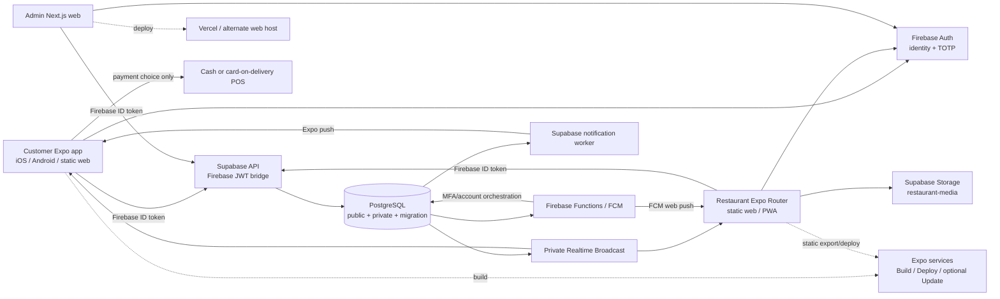
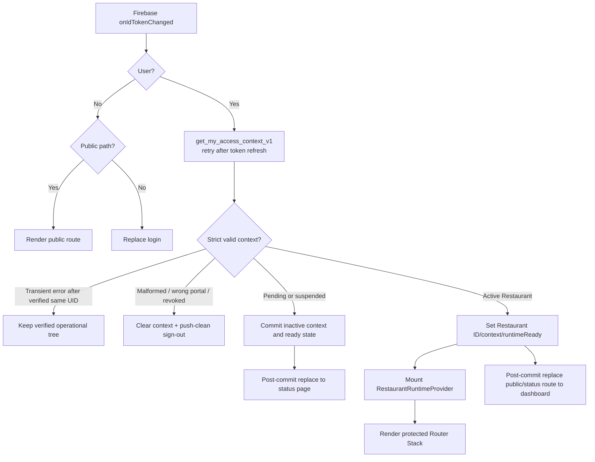
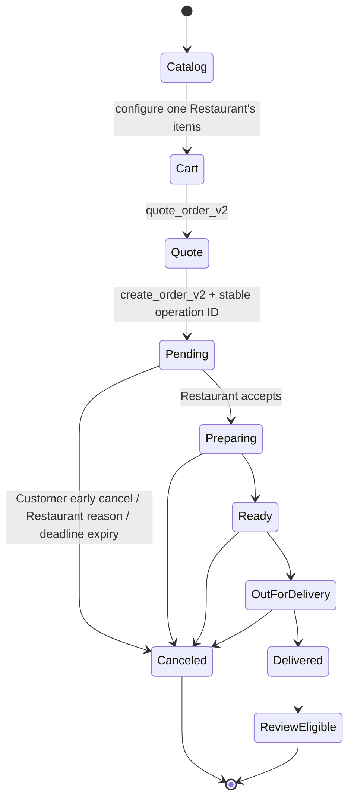
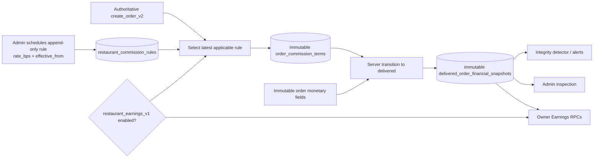

# Hungrie Complete Technical Handover

**Audit date:** 2026-09-24
**Repository checkpoint inspected:** `d2e86dd42b37a327289b908129ac8df006712d51` on branch `phase7-full-staging-qualification-20260918`
**Method:** repository, Git history, source, migrations, tests, reviews, manifests, and sanitized preserved evidence; no hosted access
**Original audit boundary:** the 2026-09-24 report was repository-only; the 2026-09-29 closeout updates current status without asserting current provider state.
**Current status update (2026-09-29):** Restaurant Responsive UI Phase 6 is `PASS / ACCEPTED / CLOSED` for the qualified Vercel Staging browser/PWA/FCM path. Production readiness is `NOT YET APPROVED / NOT EXECUTED`; no Production release is authorized.

The detailed audit body records the repository state as of 2026-09-24. Statements describing Phase 6 as blocked, Expo alias incidents, or older candidate gates are historical unless a 2026-09-29 status update explicitly supersedes them.

## How to read this report

The classifications used throughout are:

- **Implemented and verified in source:** present in the inspected checkpoint and directly corroborated by code, migrations, or generated contracts.
- **Implemented but not fully qualified:** present in source, but an applicable hosted, physical-device, provider, or release gate is outstanding.
- **Planned/documented only:** described in a plan or runbook but not established as running implementation.
- **Disabled:** implemented behind a capability/runtime gate whose preserved evidence says it is off.
- **Deprecated/legacy:** retained for migration or compatibility and not the intended first-release path.
- **Unknown:** repository and preserved evidence cannot establish the current external state.

Documentation is treated as evidence of what a prior run recorded, not as proof of current hosted state. Paths are relative to the repository root. This report intentionally omits credentials, tokens, private evidence payloads, personal information, and raw database records.

---

## 1. Executive system overview

Hungrie is a campus-oriented food-ordering platform. Customers discover Restaurants, configure menu items, maintain a single-Restaurant cart, obtain a server quote, choose a delivery address and pay-on-delivery method, and submit an order. Restaurant staff operate a separate web/PWA console to accept and progress orders, manage catalog/settings, handle anonymous feedback, and, for owners only, view the implemented-but-disabled Earnings feature. Administrators use a separate MFA-protected web application for account, Restaurant, order, incident, review, audit, and commission administration.

### Major applications and services

| Component | Location | Role | Current classification |
|---|---|---|---|
| Customer application | `mobile/` | Expo Router app for iOS, Android, and static web | Implemented; Staging Phase 7 accepted; no public Production release |
| Restaurant application | `apps/restaurant/` | Expo Router static web/PWA, desktop-first with responsive phone/tablet layouts | UI Phases 1–6 accepted for the qualified Vercel Staging path; Production not approved |
| Admin application | `apps/admin-web/` | Next.js App Router web app with Firebase TOTP MFA | Implemented and Staging-qualified in earlier accepted phases; Production not active |
| UI reference mock | `apps/restaurant-ui-mock/` | Fixture-driven React Native Web design reference | Isolated reference only; never a production dependency |
| Shared domain package | `packages/domain/` | Pure cross-portal types, access contexts, earnings contracts | Implemented |
| Generated DB types | `packages/database-types/` | Supabase `public` schema TypeScript contract | Implemented; regeneration tied to migrations |
| Shared config | `packages/config/` | TypeScript/configuration bases | Implemented |
| Supabase | `supabase/` | PostgreSQL, RLS, RPCs, Storage, Realtime, Cron, Edge notification worker | Authoritative application-data backend |
| Firebase | `functions/`, browser/native SDK use | Authentication, TOTP, FCM/Expo push integration, account-deletion orchestration, transitional legacy triggers | Identity and notification integration; not business authorization |
| Operator tooling | `scripts/`, `functions/scripts/` | Guarded migrations, probes, backups, deployment, qualification, cleanup | Implemented; many commands mutate hosted state and require explicit approval |
| Restricted evidence | ignored `secure/` | Owner-only backups/manifests/evidence | Present locally; not inspected for private row contents |

### Release and environment model

- **Local** uses Supabase CLI/PostgreSQL 17, emulators or local app runtimes, synthetic adapters, and local static exports. Local qualification is not hosted qualification.
- **Development** and **Staging** use distinct Supabase projects and deployments/secrets but intentionally share one non-production Firebase Auth pool. This is an accepted non-production compromise, not Production isolation.
- **Production** is not established as an active release environment. The approved architecture requires new, clean Firebase and Supabase Production projects, token-isolation tests, maintenance-first deployment, production-safe catalog approval, backups/restore drills, signed candidates, and explicit owner go/no-go approval.
- No live public Customer application or Production user base is established by the repository evidence. Store submission is separately authorized from Production activation.

### Architecture overview



Payment is currently **cash or card on delivery via a courier-carried POS terminal**. No online card processor, gateway payment intent, saved-card vault, or tokenization implementation was found.

---

## 2. Complete repository structure

### Root and important directories

| Path | Responsibility |
|---|---|
| `mobile/` | Customer Expo application, native projects, routes, repositories, Zustand stores, localization, assets, Firebase legacy adapters, and Customer tests |
| `apps/restaurant/` | Production-intended Restaurant Expo Router web/PWA source, static assets, service worker, strict response parsers, and local qualification adapters |
| `apps/admin-web/` | Admin Next.js application and client repositories |
| `apps/restaurant-ui-mock/` | Preserved visual mock with fixtures and scenario selector; excluded from runtime imports |
| `packages/domain/` | Shared pure business/API types including access and earnings shapes |
| `packages/database-types/` | Generated Supabase database typings |
| `packages/config/` | Shared TypeScript configuration |
| `supabase/migrations/` | Sole ordered schema/RPC/RLS/trigger source; 52 files through `20260924140000_restaurant_order_conflict_transport.sql` |
| `supabase/tests/` | pgTAP authorization, workflow, finance, Realtime, review, runtime, and transport tests |
| `supabase/hosted-tests/` | Sanitized hosted SQL probes |
| `supabase/functions/notification-worker/` | Deno notification dispatch worker and pure logic tests |
| `supabase/realtime/` | Managed private Realtime policy source |
| `functions/` | Firebase Functions, notification/MFA/deletion logic, and Firebase-to-Supabase migration utilities |
| `scripts/` | Environment-aware release, migration, backup, qualification, evidence, and cleanup operators |
| `docs/` | Architecture decisions, phased reviews, runbooks, incident packages, and generated visual evidence |
| `secure/` | Git-ignored owner-only evidence/backups; treat as sensitive |
| `design/` | Ignored design material; not application runtime |
| `dist/`, `mobile/dist/`, `.expo/`, `.vercel/` | Generated/local tool artifacts, not source of truth |

### Entry points and routing

**Customer.** `mobile/app/_layout.tsx` is the root runtime composition. Expo Router routes include auth under `mobile/app/(auth)/`, tabs under `mobile/app/(tabs)/`, `checkout.tsx`, `orders.tsx`, `orders/[id].tsx`, Restaurant detail, reviews, addresses, support, terms, and privacy. `mobile/app/index.tsx` redirects into the Customer experience. Source still contains `mobile/app/admin/`, `mobile/app/restaurantpanel/`, and `mobile/app/courier.tsx`; root layout detects these legacy privileged paths and redirects them to `/home`. Their files remain technical debt and some legacy review dependencies are still reachable within the old panel source.

**Restaurant.** `apps/restaurant/app/_layout.tsx` loads local font packages, the locale provider, `AuthGate`, and the Expo Router `Stack`. Static routes include `/login`, `/forgot-password`, `/invite`, `/dashboard`, `/orders`, canonical `/orders/detail?orderId=...`, compatibility `/orders/[orderId]`, `/history`, `/menu`, `/restaurant`, `/reviews`, `/settings` (Alerts), `/security`, `/more`, `/earnings`, `/pending`, and `/suspended`.

**Admin.** `apps/admin-web/app/layout.tsx` mounts `AdminProviders`; `apps/admin-web/app/(admin)/layout.tsx` mounts `AuthGate` and `AdminShell`. App Router pages cover dashboard, Restaurants and Restaurant detail/commission, accounts, orders, Reviews, incidents, audit, security, login, invitation, MFA onboarding, and suspended state. `apps/admin-web/app/reviews-preview/page.tsx` is a preview route and should not be confused with the operational Reviews route.

### Manifests and primary commands

- Root workspace: `package.json`, `package-lock.json`, `tsconfig.json`; workspaces cover `mobile`, `apps/*`, and `packages/*` while `functions/` retains a separate runtime.
- Customer: `mobile/package.json`, `mobile/app.json`, `mobile/eas.json`; `npm run start|ios|android|web`, `npm --prefix mobile run export:web`, preview/production EAS build commands.
- Restaurant: `apps/restaurant/package.json`, `app.json`, `eas.json`; `npm run export:web --workspace @hungrie/restaurant` runs Firebase-config preparation then Expo static export.
- Admin: `apps/admin-web/package.json`, `next.config.ts`; `npm run build --workspace @hungrie/admin-web` and `next start`.
- Whole proof build: `npm run build:proof` builds shared packages, Restaurant static export, and Admin.
- Database: `npm run supabase:start`, `supabase:lint`, `supabase:test`, and `supabase:types`. `supabase:reset` is destructive to the local database and was not run for this audit.

### Active versus legacy/preview/generated

- Production-intended: `mobile/src/data/supabase/*`, Customer v2 flows, `apps/restaurant`, `apps/admin-web`, current migrations, notification worker, shared packages.
- Disabled but production-intended: Restaurant Earnings/commission snapshot pipeline behind `restaurant_earnings_v1`.
- Legacy: Firestore application-data adapters/rules, Firebase order triggers at the start of `functions/index.js`, Customer-embedded Restaurant/Admin/Courier routes, v1 review facades/RPCs, migration staging schemas.
- Preview/reference: `apps/restaurant-ui-mock`, Customer review preview routes, Admin `reviews-preview`.
- Generated: database types, native `mobile/ios` and `mobile/android`, Expo/Vercel caches, static exports, screenshot matrices, and artifact manifests.

---

## 3. Application architecture

### Customer application

- **Stack:** Expo 54, React Native 0.81, React 19, Expo Router 6, Firebase Auth, Supabase JS, Zustand, i18next, NativeWind plus React Native styles, Expo Notifications, Sentry optional.
- **State:** `mobile/store/auth.store.ts`, `cart.store.ts`, and `favorites.store.ts`; feature-local state/hooks for addresses, Reviews, runtime gates, and notifications.
- **Providers/gates:** root gesture, theme, safe-area, release, connectivity, maintenance, customer-access, notification, and review-recovery composition lives in `mobile/app/_layout.tsx`.
- **Data:** facade modules such as `mobile/src/data/orderRepository.ts` select Supabase implementations through `backendSelection.ts`/`backendFlags.ts`. Firebase remains the auth repository; migrated business repositories are configured for Supabase.
- **Navigation:** public browsing and auth routes plus guarded checkout/profile/orders. Legacy privileged paths are blocked at root.
- **Localization:** `mobile/src/lib/i18n.ts` supplies English/Turkish and restores `hungrie.language` before push registration.
- **Offline/loading:** explicit Internet gate; repository errors and skeletons; Customer order Realtime coordinator re-fetches authoritative RPC projections. The cart is local Zustand state, but prices/totals are re-quoted by the server.
- **Error handling:** localized user messages, generic auth messages, bounded retry, request deadlines, and uncertain checkout reconciliation.
- **Main screens:** Home/discovery, Search/categories, Restaurant menu/configuration, Cart, Checkout, Orders/detail/pending tracker, Profile/addresses/preferences, and Customer Reviews.
- **Mobile versus web:** one RN codebase adapts by `Platform`, stable window dimensions, safe areas, and responsive styles. Native uses Expo push and native builds; web lacks the same native remote-push path and uses fallback status watching where configured.

### Restaurant application

- **Stack:** Expo 54 static web output, React/React DOM 19, semantic DOM/CSS, Expo Router, Firebase browser Auth/Messaging, Supabase JS, Lucide icons, locally bundled Outfit and DM Sans packages.
- **State:** React context/hooks only; no global store. `RestaurantProviders` owns locale. `AuthGate` owns verified access. `RestaurantRuntimeProvider` owns dashboard, online/Realtime health, and order-event revision.
- **Data:** caller-bound repositories use RPCs and strict exact-shape parsers. Page containers retain fetch/mutation ownership; design components receive typed data/callbacks.
- **Navigation:** persistent desktop sidebar at `>=1024px`; fixed four-tab bottom navigation below it; `/more` holds secondary navigation. Earnings is role-filtered to active owners.
- **Localization:** English/Turkish; locale stored in browser local storage and sent during push registration.
- **Error/offline:** data states distinguish loading, stale retained data, permission, validation, conflict, unknown outcome, and offline. Mutations are blocked or reconciled rather than assumed successful.
- **Notifications:** FCM Web Push, service worker, foreground handler, audio unlock, install guidance, registration/unregistration replay semantics.
- **Main screens:** Login/invitation/reset, access states, dashboard, live orders/detail, history, menu management, Restaurant settings, Reviews, Alerts, Security, Earnings.
- **Mobile versus web:** current deliverable is web/PWA. Responsive CSS implements mobile/tablet layouts, but native Restaurant iOS/Android support is not approved; `supportsTablet` is false in the current iOS config.

### Admin application

- **Stack:** Next.js 16 App Router, React 19, client-side Firebase Auth/TOTP, Supabase JS, plain CSS.
- **State/providers:** `AdminProviders` owns locale; `components/AuthGate.tsx` rechecks current access context per route; screens generally use local state and RPC repositories.
- **Authorization:** active Admin account, verified onboarding, and current TOTP-authenticated session are required. Sensitive server RPCs independently enforce role and recent-authentication requirements.
- **Data:** `OperationalPage` handles paged administrative views; specialized strict repositories exist for Reviews and commission.
- **Navigation:** `AdminShell` sidebar with dashboard, Restaurants, accounts, orders, Reviews, incidents, audit, and security.
- **Error/loading:** generic support-safe references and no-store headers; operational pages expose pagination and retry/error states.
- **Mobile versus desktop:** responsive CSS collapses the sidebar/navigation and grids, but this remains a web application.

### Separation and residual combined-app code

The intended architecture is three independently deployed portals sharing identity infrastructure, database contracts, and pure packages—not routes, state, or authorization assumptions. The separation is implemented for current Restaurant and Admin portals. Residual combined-app code remains under `mobile/app/admin`, `mobile/app/restaurantpanel`, `mobile/app/courier.tsx`, panel components/hooks, Firebase services, and legacy review adapters. Root Customer routing blocks entry, but source retention prevents claiming complete legacy removal.

---

## 4. Authentication and authorization

### Identity model

Firebase Authentication answers who the caller is and supplies the ID token. The Supabase Firebase integration accepts the transport claim and maps the Firebase subject; PostgreSQL decides what the caller may do. `role: authenticated` is a transport requirement, not a Hungrie business role.

`private.account_access` is the v1 business identity record. Account types `customer`, `restaurant`, and `admin` are mutually exclusive and intended to be immutable. One Restaurant identity maps to exactly one Restaurant and role (`owner` or `manager`). Admin roles are `admin` or `super_admin`. UI access-context results guide routing but do not authorize later operations; every protected RLS/RPC path re-evaluates current database state.

### Access states

- **Customer:** `CustomerAccessGate` and `resolveCustomerAccess` call `get_my_access_context_v1`; an eligible unmapped Customer may be bootstrapped once through `bootstrap_my_customer_account_v1` using a persisted stable operation ID. Wrong-role, suspended, revoked, deleted/tombstoned, or configuration-conflict states fail closed.
- **Restaurant:** resolved Restaurant context includes account status, onboarding step, Restaurant ID/role/status, and accepting state. Pending and suspended accounts retain identity only to render their status page. Revoked, wrong-role, unmapped/configuration-error, or invalid lifecycle states sign out.
- **Admin:** active Admin, verified email/onboarding, and current MFA evidence are required. TOTP is implemented using Firebase multi-factor APIs. High-impact database RPCs require recent auth (initially a five-minute window). Super-admin-only boundaries include privileged role/ownership and recovery operations.

### Sessions and token lifecycle

All portals configure Firebase browser session persistence. Supabase clients set `persistSession:false` because Supabase Auth is not the session owner; their `accessToken` callbacks fetch the current Firebase ID token. Token-change listeners restore state. Restaurant retries access context after a forced ID-token refresh. Customer refreshes identity on app foreground/reconnect. Logout ends Firebase session; Restaurant uses one shared `restaurantSignOut` action that attempts push unregistration first and still signs out if cleanup fails.

### Restaurant `AuthGate` in detail

`apps/restaurant/src/AuthGate.tsx` is the crucial runtime boundary:

1. Public paths are login, forgot-password, and invitation.
2. `onIdTokenChanged` compares the current UID with `verifiedUid`. Access is cleared only when the UID changes; a pending/suspended route transition for the same UID therefore does not destroy the just-resolved inactive context.
3. `restoreAccessContext` establishes browser persistence, obtains a token, calls `get_my_access_context_v1` with a 12-second deadline, then retries once after a 250 ms delay and forced token refresh.
4. Only active Restaurant account + active Restaurant entity + onboarding `none` + non-empty Restaurant ID produces `runtimeReady`.
5. Pending/suspended context is committed as `ready` before a post-commit effect calls `router.replace`. This is the accepted UID-retention and post-commit navigation behavior.
6. Protected children are rendered only inside `RestaurantRuntimeProvider` when `runtimeReady` is true. Status pages render without that provider only when their exact inactive context matches. Otherwise only the access overlay renders.
7. Once the same browser UID has verified active access, a transient context/network failure preserves the operational tree; protected RPCs still reauthorize server-side. Contract-shape errors clear the context and fail closed.
8. Navigation away from public/inactive routes occurs in effects after React commits the provider-wrapped ready render. The Router stack stays mounted during route changes.



### React error #185 history

Candidate `mn77ek9rg5` passed immutable owner/manager tests but a real pending account transitioning from `/dashboard` produced React minified error #185, returned to a blank login route, and caused rejection/rollback. The first correction (`920ccda`) ensured protected navigation happens only after runtime-provider mounting. The subsequent correction (`69498f3`) retained the same Firebase UID for inactive states and committed pending/suspended access before navigation. Local lifecycle evidence then passed pending, suspended, owner, and manager cases. This fixed the identified component lifecycle behavior in source; it did not complete Phase 6 because later alias delivery parity failed.

### RLS and authorization boundaries

The database uses forced RLS/private schemas, minimum execute grants, security-definer RPCs with empty `search_path`, caller-bound Restaurant/customer helpers, current-session MFA checks, and append-only audit operations. No UI-selected Restaurant ID grants Restaurant authority; Restaurant operational RPCs derive scope with `private.current_restaurant_id()`/`private.require_active_restaurant()`. Public catalog and published-review reads are intentionally broader. RLS is the final boundary even when a route guard is wrong.

---

## 5. Database and backend

### Schemas and principal relations

- `public`: API-facing profiles, Restaurants, categories, menu items and definitions, addresses, favorites, orders/items, product reviews, and order reviews.
- `private`: account access/invitations/operations, legacy roles/memberships, order history/contacts/visibility, Restaurant operation ledger, push preferences/tokens/events/deliveries, incidents, audits, customer-review operations/reports, runtime/release policy, Firebase tombstones, cancellation messages, and financial tables.
- `migration`: staging, quarantine, import-run, and source-document records for controlled Firebase migration.
- `storage`: `restaurant-media` object policies.
- `realtime`: private Broadcast receive policies; raw order publication is not the contract.
- `cron`: pending-order expiry, notification wake-up, incident detection, and financial-integrity scheduling where migrations configure them.

Key relationships: a profile maps from one Firebase subject; `account_access` determines portal and, for Restaurant accounts, one Restaurant membership. Restaurants own categories/menu items/options/ingredients. Orders belong to one Customer profile and one Restaurant and contain immutable item/address/price snapshots. Status history and Restaurant visibility are private children. Reviews require delivered-order authority. Financial terms attach one commission rule to each qualifying order at order creation; delivered snapshots attach immutable financial results.

### RLS, functions, triggers, jobs, Realtime, and Storage

- Application clients primarily call versioned `public` RPCs. Private tables revoke direct client access; owner roles and forced-RLS policies constrain server-owned operations.
- `get_my_access_context_v1` is the shared portal context RPC. Customer v1 release RPCs, Restaurant v1/v2 management/order RPCs, Admin v1 operations, and Review v2 RPCs are the current contract families.
- Updated-at, review metric, order Realtime invalidation, notification materialization/wakeup, account-state synchronization, order expiry, immutable finance, and delivered-finance triggers are present.
- `private.expire_pending_orders` owns expiry; the Customer repository intentionally implements auto-expiry as a no-op to avoid a second scheduler.
- Private Realtime uses minimal Broadcast invalidations and re-fetch, not authoritative mutation payloads.
- `restaurant-media` is publicly readable, but authenticated write/delete policies require the first path component to equal the caller's Restaurant. Application validation allows JPEG/PNG/WebP up to 5 MB; policy/source evidence should be rechecked together before changing limits.

### Server-authoritative values

Clients must never be trusted to set identity, tenant, role, lifecycle, accepting eligibility, menu price, selected option validity, minimum order, subtotal, fees, discount, tip, total, state transition validity, deadlines, review ownership/visibility, notification delivery state, commission, Earnings, or financial warnings. `quote_order_v2` and `create_order_v2` rebuild item definitions from current catalog data. The database stores integer kuruş and commission basis points.

### Conflict transport and concurrency

Restaurant acknowledgement, transition, and cancellation require the exact current order version plus a stable UUID operation ID. The operation ledger makes exact replay idempotent and rejects the same ID with changed input. Concurrent mutations serialize against the order; one may succeed while the stale competitor fails.

The migration `20260924140000_restaurant_order_conflict_transport.sql` adds `private.raise_restaurant_order_conflict_v1`. Internally it avoids PostgreSQL's automatic serialization retry while preserving the accepted external PostgREST response: **HTTP 409 with JSON code `40001`**. Client classification in `orderModel.mutationFailureKind` treats that as a conflict. The client must refresh and show authoritative state before enabling a new action. Stable IDs are reused only for the same intent; a genuinely new action gets a new ID. Preserved Staging probes recorded 77–154 ms conflicts, one 200/one 409 under concurrency, no stale side effects, and exact replay. Current live hosted behavior was not re-read in this audit.

---

## 6. Complete order lifecycle



1. **Discovery/catalog.** Customer repositories call public catalog/search and `get_active_restaurant_bundle_v2`; only active/accepting Restaurants and active catalog definitions should be orderable. Public caching is separated from private Customer data.
2. **Configuration.** `RestaurantMenuScreen`, menu utilities, and cart models preserve item IDs, quantities, selected option IDs, removed ingredient IDs, and distinct configured-line keys.
3. **Cart.** `cart.store.ts`/`cartModel.ts` enforce one-Restaurant behavior and compute display estimates. Client totals are advisory.
4. **Minimum/pricing quote.** `quoteOrder` calls `quote_order_v2`, which runs `private.build_order_quote_v2`, validates menu/group constraints, uses current integer-kuruş prices, applies authoritative delivery/service/discount/tip values, and rejects below `restaurants.minimum_order_kurus`. A hard-coded Customer UI fallback (`MINIMUM_ORDER_TOTAL = 250`) exists in `cartCheckoutModel.ts`; the server quote remains authoritative and this duplication is a risk.
5. **Payment choice.** Checkout selects `cash` or `pos`. Here `pos` means card on delivery; no card details enter the request.
6. **Idempotent creation.** `checkoutOperation.ts` persists one UUID per normalized request signature and cart signature. `placeOrder` calls `create_order_v2` with the stable ID. `private.customer_order_operations` prevents duplicate orders and changed-input replay.
7. **Uncertain outcome.** If creation times out or transport is ambiguous, the UI must not generate a second ID blindly. Checkout recovery uses the persisted operation, rechecks authoritative Customer orders, and clears the operation only after reconciliation/cart change.
8. **Initial state/deadline.** The database stores the order and immutable item/address/pricing snapshots in `public.orders`/`order_items`, plus an `approval_deadline_at` five minutes after creation. Notification and private Realtime events are derived server-side.
9. **Restaurant visibility.** `restaurant_list_orders_v1` loads active orders. `useActiveOrders` reconciles initial load, private `order_changed`, focus/visibility/online events, and polling fallback. A card/detail becomes acknowledged only after the visibility rule; `restaurant_acknowledge_order_seen_v1` is versioned/idempotent.
10. **Acceptance/progression.** The Restaurant UI exposes the supported sequential subset `pending -> preparing -> ready -> out_for_delivery -> delivered` through `restaurant_transition_order_v1`. The canonical server graph also handles cancellation/expiry. There is no drag/drop mutation authority.
11. **Cancellation.** Restaurant cancellation uses `restaurant_cancel_order_v2`, an enumerated reason (`too_busy`, `item_unavailable`, `closing`, `equipment_issue`, `delivery_unavailable`, `other`) and an optional normalized Customer-facing message. Customer cancellation is server-limited to the allowed early window. Admin support can resolve eligible open orders through guarded Admin RPCs.
12. **Expiry.** Database/Cron owns pending expiry and status history. Client countdown derives from server deadline/time and reconciles rather than declaring expiry itself.
13. **Delivery/review.** Delivered time is server-recorded; Review v2 eligibility and one-review-per-order rules are server-enforced. When Earnings is enabled and valid terms exist, delivery also creates an immutable financial snapshot.

The authoritative order is always `public.orders` plus its immutable item/contact/history children, exposed through caller-specific RPC projections. Realtime payloads are invalidation hints. Polling/focus/reconnect recovery and monotonic version replacement prevent older responses from overwriting newer state.

---

## 7. Payment and commission architecture

### Current payments

Implemented payment methods are database enum values `cash` and `pos`. Customer copy describes POS as a wireless terminal brought by the courier. The server stores only the method and monetary order fields. Searches of application, database, and backend code found no payment gateway SDK, merchant API, payment intent, authorization/capture, card PAN/CVV input, saved-card record, token vault, 3-D Secure, webhook, or refund integration.

Therefore:

- Card data does not reach Hungrie in the implemented flow because no card-entry flow exists; payment occurs on the external physical POS terminal.
- Any bank Virtual POS, online card payment, saved-card, gateway tokenization, refund, PCI scope, or uncertain authorization/order choreography is **planned/unknown**, not implemented.
- It is unverified whether an external courier/Restaurant POS estate has operational bank requirements; no bank contract or gateway specification is in this repository.
- If online payment is introduced, a provider-hosted/tokenized design should ensure PAN/CVV never reaches Hungrie, but that is a future design requirement, not a current fact.

### Commission and Earnings

`20260922100000_restaurant_earnings_admin_commission.sql` implements:

- append-only `private.restaurant_commission_rules` with integer `rate_bps`, `commission_contract_version`, `effective_from`, creator, reason, and operation ID;
- immutable `private.order_commission_terms` selected at authoritative order creation;
- immutable `private.delivered_order_financial_snapshots` containing subtotal, discounts, delivery/service/tip, commission base/rate/amount, estimated Restaurant net, method, rule, and contract version;
- integrity-alert detection and a five-minute Cron job;
- owner-only Restaurant summary/series/keyset-page RPCs;
- Admin read/schedule RPCs with Admin/Super-admin and recent-MFA controls;
- immutable triggers, activation guard, exact rounding helper, direct-table denial, and capability row `restaurant_earnings_v1`.

Commission base is `greatest(subtotal_kurus - discount_kurus, 0)`. Commission is calculated server-side in integer kuruş from basis points; net is base minus commission. Rule selection is by the latest `effective_from <= order.created_at`, so later rules do not retroactively alter existing order terms. Only delivered snapshots feed Earnings. Managers are denied financial RPCs and navigation; active owners can access the UI contract. Admins can inspect; scheduling a rule is restricted according to the Admin role/recent-auth rules.



### Exact 500-bps finding

The repository contains preserved evidence that on 2026-09-23 a guarded **Staging-only** Stage A operation created exactly 11 prospective version-1 rules at **500 basis points** with `effective_from = 2026-09-24T09:00:00Z`, corresponding to **12:00 Asia/Famagusta**, not 00:00. `docs/restaurant-earnings-staging-commission-configuration-review.md` records the rule/audit reconciliation and that capability remained disabled.

This proves a prior scheduling run, not current activation. It does **not** prove that:

- the rules remain present now;
- the effective time passed without later change;
- `restaurant_earnings_v1` was enabled;
- new orders received financial terms;
- Restaurant Earnings became visible/populated;
- Production received any rule.

The last preserved evidence says capability `false`, Stage B was not started, activation was not authorized, and Phase 6 runs continued to verify it disabled. Current database state is **UNKNOWN** without authorized hosted read-only checks. The exact safe check is: resolve the Staging project identity; run read-only queries for the capability row, all applicable/future rules and their audit operations, nonterminal orders missing terms, delivered orders missing snapshots, integrity warnings, migration history/checksums, and guarded owner/manager RPC results. Do not enable the capability during that check.

---

## 8. Notifications and Realtime

### Customer

- Native push uses `expo-notifications`; registration is abstracted through `NotificationManager` and the Supabase notification repository.
- Device tokens record platform/provider and language. `register_my_customer_push_token_v2` and the 2026-09-21 language migration keep Turkish/English payload selection aligned with app language.
- `supabase/functions/notification-worker` claims deliveries, renders localized content, dispatches, and records results/retries. Database events/materialization are server-controlled.
- Foreground/cold-start response handling in `mobile/app/_layout.tsx` deduplicates by event/order key and routes to guarded order detail. Unsupported web/native configurations use an order-status watcher rather than duplicate full-history listeners.
- Permission, Android channels, reconnect/foreground bounded retry, token unregistration, and notification preferences are explicit. Push is a wake-up convenience; authoritative order state is always reloaded.

### Restaurant

- `NotificationCard` checks Firebase Messaging support, iOS standalone mode, service-worker readiness, permission, token acquisition, and exact server registration response.
- `restaurant_register_web_push_v1` and `restaurant_unregister_web_push_v1` use stable operation IDs. Unknown outcomes remain unknown until same-intent replay succeeds.
- `public/sw.js` handles background FCM payloads, localized data, and canonical `/orders/detail?orderId=...` navigation. The service worker must never cache authenticated application data.
- Foreground `onMessage` plus Realtime insert alerts use `alertRestaurantOrder`; session storage deduplicates a new-order event for ten minutes. Browser audio is unlocked only after user interaction.
- A real captured `beforeinstallprompt` is required before showing an install action; iOS gets Home Screen instructions.
- Sign-out attempts server/token unregistration before Firebase sign-out.

### Private Restaurant Realtime model

`RestaurantRuntimeProvider` creates exactly one channel: `restaurant-orders:v1:<restaurantId>` with `{private:true}` after `supabase.realtime.setAuth()`. The database policy `private.can_subscribe_restaurant_v1_topic` authorizes only the active caller for that Restaurant. The app listens only for `order_changed`, increments a revision, and re-fetches the dashboard/orders. Cleanup removes the channel on identity/provider unmount. Because only the runtime provider constructs the production channel, all pages share it and duplicate per-column/per-page subscriptions are avoided. The active-order list derives all desktop columns from one authoritative result.

Realtime is supplemented by periodic polling, subscription-state reconciliation, window focus, document visibility, browser online, and a monotonic request sequence. A connected indicator requires network + subscribed Realtime + successful reconciliation; browser `navigator.onLine` alone is insufficient.

---

## 9. UI and design system

### Customer

Customer uses Chairo Sans, an orange primary (`#FE8C00`), slate ink (`#0F172A`), light background (`#F8FAFC`), white surfaces, semantic success/warning/danger roles, 8–32 px radii, and 4–32 px spacing tokens. It supports automatic light/dark themes, safe areas, reduced motion, capped text scaling, bottom-tab navigation, responsive web widths, skeleton/loading states, and English/Turkish. Accessibility helpers include explicit labels, 44-ish touch targets, focus/order care, contrast-aware theme tokens, and reduced-motion handling; device testing remains the stronger evidence than source alone.

### Restaurant

Restaurant uses a cream canvas `#FFF8EF`, navy ink `#0F1729`, orange `#FF6520`, white cards, status colors, Outfit headings, and DM Sans body. Tokens live in `src/design/tokens.css`; reusable DOM components and patterns live under `src/components` and `components.css`. Breakpoints are `<768`, `768–1023`, `>=1024`, and `>=1440`; the actual shell switches from sidebar to bottom navigation below 1024. Focus-visible outlines, skip link, semantic forms/tables/buttons/navigation, 44 px targets, dialog focus containment/restoration, live regions, and reduced-motion CSS are implemented. There is no Restaurant dark theme.

Responsive UI phase status:

| Phase | Scope/result |
|---|---|
| Phase 0 | Baseline/mock/design/contract audit accepted |
| Phase 1 | Tokens, shell, auth/access presentation, Dashboard foundation implemented |
| Phase 2 | Live orders and responsive detail with existing order contracts implemented |
| Phase 3 | History, menu management, and Restaurant settings implemented |
| Phase 4 | Reviews, Alerts, Security, and Earnings presentation implemented |
| Phase 5 | Edge states, accessibility, Chrome/Edge-macOS/Safari matrices, responsive/performance evidence; owner accepted |
| Phase 6 | `PASS / ACCEPTED / CLOSED` on 2026-09-29 for the qualified Vercel Staging browser/PWA/FCM path; earlier conflict, AuthGate, and alias-delivery incidents remain historical |

The integration plan now records Phase 6 acceptance. `apps/restaurant-ui-mock` remains an isolated reference. Staff and Restaurant incidents concepts were not promoted. History server search/filter, opening-hours editing, Restaurant profile-image upload, synthetic device metadata/preferences, and native Restaurant approval remain deferred.

Phase 6 closed on qualification `restaurant-vercel-notification-click-qualification-20260929aj` after the prerequisite Vercel Staging browser/PWA/FCM evidence and the real physical notification-click result completed the accepted chain. This does not qualify Production configuration or activate Earnings.

### Admin

Admin uses Inter/system fonts, warm gray canvas, white panels, brown/navy-like dark sidebar (`#211F1B`), brick primary (`#B63C20`), responsive tables/grids, visible focus outline, modal and form patterns, and English/Turkish. It has functional responsive CSS but a less formal component design system than Restaurant. No dark mode is implemented.

---

## 10. Build, deployment, and hosting

### Expo and native delivery

- Expo Router is essential to Customer and Restaurant routing/export. Expo SDK/native config plugins are essential to Customer native build configuration.
- EAS Build is the configured cloud/local signing pipeline for Customer iOS/Android. `mobile/eas.json` defines development, preview (internal APK/ad hoc), and production profiles; production auto-increments and Android emits an app bundle. Native source directories also exist.
- EAS Submit is configured for Customer Production but public submission needs separate approval.
- EAS Update is mentioned in legacy README guidance, but the inspected current app configs do not establish a complete OTA update/channel/runtimeVersion policy. Do not assume OTA is an active release mechanism.
- EAS Deploy/Hosting is used for Restaurant static web immutable deployments and aliases. It is a hosting choice, not required for Expo Router source or native apps.
- Admin is built by Next.js and prior evidence uses immutable Vercel deployments/alias promotion.

### Web static export and environment configuration

Customer and Restaurant declare Metro `web.output = static`. Restaurant export runs `scripts/write-firebase-config.mjs`, emits static route HTML/assets plus `manifest.webmanifest` and `sw.js`, and relies on host fallback/deep-link correctness. Public Firebase/Supabase client configuration is environment-owned and embedded by design; service keys, Firebase Admin credentials, backup keys, and operator tokens must never enter client bundles. Admin reads `NEXT_PUBLIC_*` client configuration and chooses environment-specific Firebase callable names from build-owned `NEXT_PUBLIC_HUNGRIE_ENV`.

Development/Staging/Production are selected explicitly by EAS/Vercel/operator configuration. Guarded scripts resolve expected project IDs, reject other registered environments, pin source/migration hashes, capture rollback targets, produce manifests, and require action-specific confirmations. Immutable artifacts are hashed before alias assignment. Rollback is a separately verified alias/content operation, not merely a successful CLI response.

### Headers, CSP, PWA, and service workers

Restaurant `app.json` configures private/no-store caching for HTML, CSP, HSTS, nosniff, frame denial, referrer policy, and disabled camera/microphone/geolocation. CSP permits required Supabase/Firebase endpoints and workers. Admin `next.config.ts` configures similar headers, but includes `'unsafe-inline'` in script/style policy; this is a documented hardening concern, not proof of an exploit. Host behavior must be verified because config intent alone does not prove deployed headers.

Restaurant service worker scope must remain `/`, FCM scripts/config must load, notification clicks must reach canonical static routes, and authenticated responses/data must not be cached. A hosting migration must preserve `manifest.webmanifest`, icons, service worker MIME/scope/update behavior, HTTPS, no-store HTML, and immutable hashed assets.

### Hosting Restaurant/Admin outside Expo Hosting

Technically feasible without changing application business logic:

- Restaurant output is static and can be hosted on a CDN/static host that supports HTTPS, exact files, directory/index fallback, custom headers, and service-worker scope. Firebase Auth authorized domains, FCM Web Push/VAPID, Supabase allowed origins where applicable, CSP `connect-src`, canonical domain, PWA manifest start URL/scope, and all notification deep links must be updated/verified. Every static route—including `/orders/detail`—must return its export, while query strings remain intact. Avoid SPA rewrites that replace real static files or return 200 HTML for hashed assets. Verify logout/private-cache behavior and alias-to-artifact parity.
- Admin can run on any Node/Next-compatible platform or be adapted to static output only after proving every route/config feature supports it. Current `next.config.ts` headers and App Router deployment assume a Next-capable host. Firebase authorized domains, Cloud Functions region/endpoints, Supabase origins, CSP, no-store responses, invitation deep links, MFA routes, environment variables, immutable release IDs, rollback, and server/runtime compatibility must be reproduced.
- Moving web hosting does not replace EAS Build for Customer native binaries. Expo Router itself does not require Expo Hosting. EAS Update, EAS Hosting, Vercel, and alternate CDN choices are separable from the native compilation/signing need.

No hosting migration was performed or authorized by this audit.

---

## 11. Current Expo alias delivery incident

### Incident chain

1. Accepted UI application checkpoint: `c2cf45f` (Responsive UI Phase 5). Initial Phase 6 candidate `s4ad8ky39f` passed export/immutable/alias parity but was rejected because stale version conflict requests exceeded the client timeout.
2. Conflict transport remediation `1dedebe` and runtime-provider fix `920ccda` produced candidate `mn77ek9rg5`. Conflict probes and active owner/manager paths passed, but real pending access caused React #185; candidate rejected and alias rolled back.
3. Inactive access correction checkpoint `69498f` produced candidate `bfh8u5a0dh`. Immutable pending/suspended/owner/manager and recovery checks passed. Post-promotion alias content did not match the candidate; evidence from this older failure was insufficient to identify which generation was served. Candidate rejected; no retry.
4. Alias-verifier hardening checkpoint/current HEAD `d2e86dd` is the accepted operator checkpoint for retry run `ruip6a_20260924c`. Candidate `ipcij64k47` passed exact immutable artifact parity and mandatory immutable authentication.
5. One alias assignment occurred. The independent observer ran 10 attempts at 5-second intervals, with starts at 0–45 seconds and a hard 50-second window.
6. On all attempts alias metadata named `ipcij64k47`, but all six HTTP route bodies exactly matched rollback deployment `6jki82fy0u`; all five candidate critical JS/CSS paths returned HTTP 404. The mismatch was direct Node HTTP evidence, not browser or service-worker cache evidence.
7. Evidence was written before comparison: timestamps, status, sizes, hashes, ETags, cache headers, and request identifiers were preserved. A provider support package exists at `docs/restaurant-expo-alias-support-package/`.
8. Alias was reassigned to `6jki82fy0u`. Follow-up evidence verified metadata plus exact six-route and three-critical-asset rollback parity. Fixtures were manifest-cleaned; last evidence says Earnings remained disabled and 52 migrations had none pending.

### Confirmed versus hypothetical

Confirmed: immutable candidate correctness; successful alias-assignment response; metadata/content divergence; rollback HTML generation served throughout the bounded window; candidate assets 404; exact verified rollback; two rejected alias candidates; no automatic retry; Production untouched.

Unknown/hypothetical: internal Expo origin selection, whether metadata is desired or data-plane-ready state, CDN invalidation behavior, alias router behavior, separate HTML/asset publication paths, query-string cache-key behavior, and whether the earlier `bfh8u5a0dh` failure shared the same cause. **Do not state CDN caching, Expo routing, or asset publication as the root cause.** Provider telemetry is required.

### Current environment state

The last verified preserved state is Staging alias `6jki82fy0u`, rollback root hash recorded in the incident evidence, clean tagged fixtures, 52 migrations, and Earnings disabled. Because this audit made no hosted read, the live state at report time is **UNKNOWN**; it must be described as “last verified,” not “currently confirmed live.” Development and Production were not part of the incident.

At the 2026-09-24 audit, Phase 6 remained **BLOCKED** because that candidate never passed mandatory exact alias content parity, so its post-alias access-state, functional, responsive/accessibility/performance, physical device/PWA/push, and populated Earnings gates could not be completed. That candidate was not approved for Production; the later accepted Vercel Staging evidence supersedes only the current Phase 6 status.

---

## 12. Security architecture

### Source-supported controls

- Firebase identity separated from Supabase business authorization; mutually exclusive account types and caller-bound scope.
- Forced RLS/private schemas, explicit grants, security-definer functions with empty `search_path`, versioned RPC contracts, and database constraints.
- Active/suspended/revoked/onboarding checks at both UI and server; Admin TOTP, current-session MFA, recent-auth gates, no-last-super-admin and ownership invariants.
- Stable operation IDs, digests, append-only audit trails, expected versions, immutable financial records, and monotonic reconciliation.
- Private receive-only Realtime topics; clients cannot publish authoritative order events.
- Upload tenant path policy, no-upsert upload, MIME/size validation, and cleanup of newly uploaded files when save fails.
- Generic auth/reset responses, support-safe references, no raw tokens in evidence, restricted ignored evidence directories, and backup encryption runbooks.
- Client bundles receive only public Firebase/Supabase configuration. Server/service credentials use Firebase secrets, Supabase Edge/Vault, external operator files, or ignored `secure/` paths.
- CSP/HSTS/frame denial/no-store intent for web portals; Sentry strips user/request data when enabled.
- Environment scripts fail closed on project identity and checksum, create restricted backups, and verify cleanup/rollback.

### Confirmed gaps or limitations

- Production projects and cross-environment token isolation are not yet established.
- Development and Staging share Firebase Auth, increasing non-production blast radius by accepted design.
- Legacy Firestore rules and privileged mobile sources still exist. They are not the target authority but enlarge maintenance/audit surface until removal.
- No active Firebase App Check initialization/enforcement was found; planning mentions it. Treat abuse protection as incomplete, not assumed.
- Repository-wide user-facing rate limiting is not comprehensively implemented or proven. Some database/input/operation constraints and Firebase/Supabase platform limits exist, but they are not a substitute for a documented abuse model.
- Admin CSP allows inline script/style; Restaurant style CSP permits inline style. This weakens CSP hardening but is not by itself a demonstrated vulnerability.
- Public client identifiers are tracked in app configuration, as expected for Firebase/Supabase clients; they must never be mistaken for server secrets. Their authorization safety depends on RLS/rules and environment configuration.
- `mobile/google-services.json` is tracked. It is client configuration, but package/project correctness and restriction should be periodically verified.
- Some Customer repository normalizers still use `any`; Restaurant/Admin newer contracts are stricter. Malformed Customer payload defense is uneven.
- Current hosted grants, policies, headers, Auth authorized domains, Storage rules, secret versions, and capability state are not proven by a repository-only audit.
- No online payment exists, so online payment security and PCI design are unqualified rather than secure.

### Migration safety

Migrations are forward-versioned and operator scripts pin hashes/history. Production rollback policy prefers maintenance plus corrective forward migration or verified restore; destructive reverse migration is not assumed safe. Backups and isolated restore drills are required before activation. Financial and Review legacy removal explicitly require separate dependency/data-preservation plans without `CASCADE`.

---

## 13. Testing and qualification

### Important suites and commands

| Area | Command |
|---|---|
| Root JS + DB gate | `npm test` |
| JS/repository/functions gate | `npm run test:js` |
| Database lint | `npm run supabase:lint` |
| pgTAP + concurrency | `npm run supabase:test` |
| Shared packages + Restaurant/Admin build | `npm run build:proof` |
| Customer TypeScript | `npm run typecheck` |
| Restaurant/Admin TypeScript | `npm run typecheck:proof` |
| Customer lint | `npm run lint` |
| Customer repository/auth | `npm --prefix mobile run test:repositories` |
| Cart/checkout | `npm --prefix mobile run test:cart` |
| Review v2 repository/UI | `npm run test:review-v2-repositories`; `npm run test:review-v2-ui` |
| Notification worker | `npm run notification-worker:test` |
| Restaurant UI Phases 1–5 | `npm run test:restaurant-responsive-ui-phase1` through `phase5` |
| Restaurant local visual qualification | `npm run qualify:restaurant-responsive-ui-phase1` through Phase 5 scripts |
| Conflict transport | `npm run test:restaurant-order-conflict-transport` |
| Earnings | `npm run test:restaurant-earnings-phase3`; `test:restaurant-earnings-phase4`; `phase5:restaurant-earnings:check` |
| Phase 7 runner safeguards | `npm run phase7:runner:test` |
| Alias verifier | `node --test scripts/test-restaurant-alias-parity-verifier.mjs` |

Hosted commands in `scripts/` are not ordinary tests: many create identities/data, apply migrations, deploy functions/apps, assign aliases, or clean fixtures. They require the exact reviewed plan and authorization. None was run for this report.

### Evidence interpretation

- Unit/contract tests cover parsers, state models, auth classification, checkout idempotency, Review v2, notifications, finance math, and operator safety.
- Database tests cover RLS/RPC authorization, constraints, transition concurrency, Realtime topic access, Reviews, incidents, runtime gates, Earnings, and conflict transport.
- Browser automation produced large Chrome/Edge/Safari screenshot/AX matrices for Restaurant Phases 1–5; Phase 5 recorded 820 accepted screenshots across evidence sets.
- Phase 7 Staging was accepted for the pre-redesign Customer/Restaurant/Admin baseline with automated load/deadline/incident/soak, 40 automated and 10 owner-reported manual terminal journeys, real push/device follow-ups, cleanup, and baseline reconciliation.
- Review v2 reached accepted Staging and physical-device qualification; legacy v1 removal is deferred.
- Restaurant Earnings Phase 5 proved the disabled implementation in Staging with real roles/data and immutable builds; capability ended disabled.
- Responsive UI Phase 6 is accepted for the qualified Vercel Staging browser/PWA/FCM path. Historical rejected candidates remain evidence and do not qualify Production.
- Synthetic access/visual adapters prove UI behavior, not real Firebase/Supabase behavior. Owner-reported physical checks are identified as such in source reviews.
- Protected source/artifact manifests and SHA-256 checks defend evidence reproducibility; they do not prove current provider state.

This audit did not rerun tests because the task was strictly read-only except for this report, and several build/test commands generate files or start/reset services. All pass counts in this report are prior preserved evidence, not fresh results.

---

## 14. Current project status

| Subsystem | Status | Evidence | Outstanding work / dependency / authority |
|---|---|---|---|
| Customer core app | PASS | `mobile/`; Phase 7 accepted Staging evidence | Production projects, signed release gates, go/no-go; hosted mutation approval |
| Customer order/realtime | PASS | v2 RPC repositories; Phase 7 journeys/soak | Reverify against eventual Production |
| Customer Review v2 | PASS | Phase 9 acceptance; v2 source/RPCs | Legacy removal separately planned |
| Customer online payment | PLANNED | No processor/tokenization code | Bank/provider contract and security architecture; separate approval |
| Restaurant responsive UI 1–5 | PASS | Commits `9ae07a3`–`c2cf45f`; reviews/evidence | None for local phase acceptance |
| Restaurant Phase 6 | PASS | Qualification `restaurant-vercel-notification-click-qualification-20260929aj`; acceptance record | Closed for qualified Vercel Staging path; Production readiness is separate |
| Restaurant AuthGate source fix | IMPLEMENTED_NOT_QUALIFIED | `AuthGate.tsx`, commits `920ccda`, `69498f` | Passed local/immutable; alias-level full qualification blocked |
| Restaurant conflict transport | IMPLEMENTED_NOT_QUALIFIED | migration `20260924140000`; Staging probes passed | Current live state and final Phase 6 release qualification unknown |
| Restaurant orders/menu/settings/reviews/alerts | IMPLEMENTED_NOT_QUALIFIED | source, RPCs, Phases 2–4 evidence | Redesigned candidate not fully alias-qualified |
| Restaurant Earnings code/schema | DISABLED | migration, owner UI, Phase 5 evidence; last capability false | Stage B/current read-only preflight then separate activation authorization |
| Staging 500-bps rules | UNKNOWN | Prior Stage A says 11 rules scheduled for 09:00Z | Authorized hosted read-only inventory required; no activation assumption |
| Admin core/MFA/operations | PASS | Admin app; Phase 4/5/7 accepted evidence | Production environment and final release gates |
| Admin commission UI/RPC | IMPLEMENTED_NOT_QUALIFIED | source and Earnings Phase 5 | Current rule/capability state unknown; activation not authorized |
| Supabase schema/RLS/RPC | PASS | 52 migrations in repo; extensive pgTAP/hosted reviews | Current hosted parity is unknown without read-only check |
| Private Realtime | PASS | policy/source; prior hosted probes | Reverify eventual Production |
| Notification worker/customer push | PASS | worker tests and Phase 7 push evidence | Production credentials/APNs/FCM and device gates |
| Restaurant web push | PASS_STAGING | accepted foreground/background FCM and real notification-click chain | Requalify with isolated Production configuration before release |
| Firebase legacy application data | IN_PROGRESS | legacy functions/rules/adapters remain | Controlled retirement after caller/telemetry audit |
| Development/Staging isolation | PASS | distinct Supabase, shared Firebase explicitly documented | Shared Auth is accepted non-production limitation |
| Production environment | BLOCKED | runbooks explicitly defer clean projects/activation | New projects, capacity decision, backups, release/security gates, owner approval |
| Backup/restore architecture | IMPLEMENTED_NOT_QUALIFIED | scripts/runbooks and prior drills | Fresh Production backup/bucket/restore drill required |
| Restaurant/Admin alternate hosting | PLANNED | Static/Next feasibility only | DNS/Auth/CSP/PWA/deep-link/rollback qualification and approval |
| Expo alias delivery | BLOCKED | `ipcij64k47` divergence; rollback `6jki82fy0u` | Provider telemetry or approved workaround; do not speculate root cause |

Operational restrictions: Phase 6 is complete, but do not access or mutate Production; do not enable Earnings; do not run Stage B or populated finance qualification without explicit approval; do not copy non-production identities/data to Production; do not submit stores or change Production DNS without explicit approval. Follow `docs/restaurant-production-readiness-plan.md`.

---

## 15. Technical debt and risks

### Critical/high

1. **BLOCKER — Expo alias metadata/content divergence (confirmed).** A candidate can be correct immutably while the alias serves the prior HTML and 404s the candidate assets. Evidence: current incident package. Impact: broken or mixed deployment; mandatory parity must remain fail closed.
2. **HIGH — Production is intentionally absent (confirmed).** Clean Firebase/Supabase, secrets, backups, isolation, DNS/hosting, signed artifacts, and go/no-go are still required. This is release incompleteness, not a defect in Staging.
3. **HIGH — Financial capability activation is unqualified (confirmed).** Code is substantial, but last evidence says disabled. Current rule state is unknown. Enabling without a fresh integrity preflight can fail order creation/acceptance or expose incomplete Earnings.

### Medium

4. **Legacy combined-app and Firestore surface (confirmed).** Customer source retains Restaurant/Admin/Courier routes, Firebase rules/services, and v1 Reviews. Root guards reduce exposure but do not remove code/dependencies. This complicates audits and future contract retirement.
5. **Client/server minimum-order duplication (confirmed potential inconsistency).** Customer `MINIMUM_ORDER_TOTAL = 250` can diverge from per-Restaurant `minimum_order_kurus`; server quote is correct, but UI messaging/enablement can be stale.
6. **Customer runtime typing is uneven (confirmed).** Several repository/UI paths normalize `any`, unlike strict Restaurant/Admin response parsers. This increases malformed-contract and silent-fallback risk.
7. **Admin AuthGate lifecycle differs from hardened Restaurant model (potential concern).** It resets on route changes and has its own redirect logic. No current incident is documented, but the Restaurant React #185 history suggests Admin route/MFA transitions deserve analogous browser lifecycle tests.
8. **CSP inline allowances (confirmed hardening gap).** Admin allows inline script/style; Restaurant allows inline style. Tightening requires framework-compatible nonce/hash work and deployed verification.
9. **No App Check enforcement found (confirmed absence in active source).** Platform abuse resistance relies on authentication, RLS, quotas, and contracts. Treat App Check as unimplemented unless an authorized hosted configuration check proves otherwise.
10. **Operation/reconciliation logic duplicated (confirmed).** Stable IDs, request generations, retries, and strict parsing appear independently across portals/features. This is intentional in part for portal isolation but increases drift risk; share only pure, authority-neutral primitives.

### Low/operational

11. **Documentation staleness (confirmed).** `README.md`, `STRUCTURE.md`, and the integration plan describe earlier Firebase/mock/route states. They can mislead new engineers unless source and current reviews take precedence.
12. **Very large checked-in evidence sets (confirmed).** Thousands of screenshots/manifests increase repository weight and review noise. Retention/indexing policy could preserve proof while keeping runtime source easier to navigate.
13. **EAS Update policy unclear (confirmed unknown).** README mentions OTA, but current runtime/channel policy is not established. Accidental OTA assumptions could bypass intended immutable release evidence.
14. **Native Restaurant configuration is not release-ready (confirmed).** Responsive web exists, but native device support, notification path, tablet flag, and qualification are separate.
15. **Current external state decays (inherent).** Preserved hashes prove historical runs, not today’s aliases, grants, rule inventory, or capability. Every release decision needs a fresh read-only preflight.

No vulnerability is inferred merely from missing test evidence, and no untested feature is labeled broken.

---

## 16. Recommended next technical investigations

1. **Repository-only:** freeze and verify the incident checkpoint, source/export manifests, verifier tests, provider support package, and exact rollback evidence. Review untracked Phase 6 operator scripts before any use; do not assume they belong to the accepted checkpoint.
2. **Provider-side read-only, authorized:** ask Expo support the questions in `docs/restaurant-expo-alias-support-package/provider-questions.md`, supplying sanitized request IDs/timestamps/hashes. Determine control-plane/data-plane semantics without asserting a cause.
3. **Hosted read-only, authorized:** confirm live Staging alias metadata and content against `6jki82fy0u`; check six routes and critical assets with unique requests and persisted results. Stop if the last-verified rollback has drifted.
4. **Hosted read-only, separately authorized:** inspect Staging migration parity, Earnings capability, 11-rule inventory/effective times, nonterminal order terms, delivered snapshots, warnings, and audit rows. This must not call the capability mutation.
5. **Local-only:** run the complete non-mutating source test/type/build suite in an isolated worktree, ensuring generated output stays outside the working tree. Include AuthGate lifecycle, alias verifier, conflict transport, UI phases, Review v2, notification, Earnings safeguards, CSP/export, and secret/mock scans.
6. **Repository-only:** audit Customer hard-coded minimum order against server-derived quote/settings and map a removal plan; audit Admin AuthGate with real-router lifecycle scenarios modeled after Restaurant.
7. **Repository-only:** produce a legacy removal dependency graph for mobile privileged routes, Firestore functions/rules, and v1 Reviews before changing anything.
8. **Hosted mutation—requires new reviewed plan and explicit approval:** build one new immutable Restaurant candidate, qualify it, assign the alias once, run the bounded parity observer, roll back immediately on mismatch, preserve evidence, and clean only manifest resources.
9. **Hosted mutation—separate authorization:** only after alias success, perform the remaining Phase 6 browser/device/PWA/push gates. Earnings populated qualification requires its own bounded activation window and rollback; it must not be bundled implicitly.
10. **Production mutation—future explicit approval only:** provision clean projects in maintenance, configure secrets/backups, test bidirectional token isolation, deploy pinned migrations/apps, run all gates, then request go/no-go. Store submission remains separate.

---

## 17. Architectural diagrams

### 17.1 Complete system architecture

See Section 1. The key trust direction is portal -> Firebase identity -> Supabase token bridge -> RLS/RPC -> authoritative PostgreSQL, with Realtime/push as invalidation/wake-up layers.

### 17.2 Identity and authorization flow

```mermaid
sequenceDiagram
  participant U as Portal user
  participant F as Firebase Auth
  participant S as Supabase API
  participant D as PostgreSQL
  U->>F: Sign in / restore session
  F-->>U: Firebase ID token
  U->>S: RPC + current ID token
  S->>D: JWT claims
  D->>D: map firebase subject
  D->>D: account_access + status + MFA + tenant checks
  D-->>S: access context or guarded result
  S-->>U: strict response / denial
  Note over U,D: Access context helps routing; every protected RPC rechecks live authority
```

### 17.3 Customer order lifecycle

See Section 6 state diagram. The critical sequence is quote -> stable-operation create -> pending deadline -> versioned Restaurant actions -> delivered/canceled -> review/financial aftermath.

### 17.4 Restaurant AuthGate/runtime flow

See Section 4 flowchart. Protected content never renders outside `RestaurantRuntimeProvider`; inactive status pages are the only non-public exception.

### 17.5 Web export/deployment/alias flow

```mermaid
flowchart LR
  SRC[Accepted commit + source manifest] --> ISO[Isolated export with pinned env]
  ISO --> ART[Artifact manifest + SHA-256]
  ART --> DEP[Immutable EAS deployment]
  DEP --> IMM[Exact immutable route/asset qualification]
  IMM --> PRE[Capture live alias rollback target]
  PRE --> ASG[Single alias assignment]
  ASG --> OBS[10-attempt bounded metadata + content observer]
  OBS -->|Exact parity| FUNC[Hosted functional/device qualification]
  OBS -->|Mismatch / 404| RB[Reassign captured rollback]
  RB --> VR[Verify metadata + route + asset rollback parity]
  FUNC -->|Any failure| RB
```



### 17.6 Commission and Earnings flow

See Section 7. The capability gates fail-closed term/snapshot enforcement; rules alone do not activate Earnings.

---

## 18. File and symbol reference index

| File / symbol | Why inspect it |
|---|---|
| `mobile/app/_layout.tsx` / `RootLayoutBase` | Customer provider/gate order, auth hydration, notifications, legacy route block, deep links |
| `mobile/store/auth.store.ts` | Firebase identity hydration and stale-generation protection |
| `mobile/src/features/auth/CustomerAccessGate.tsx` | Customer portal access rendering and fail-closed behavior |
| `mobile/src/features/auth/customerAccess.ts` / `resolveCustomerAccess` | access context, bootstrap, retries, wrong-role handling |
| `mobile/src/data/backendSelection.ts` | active repository selection and remaining legacy adapters |
| `mobile/src/data/supabase/orderRepository.ts` / `placeOrder`, `quoteOrder` | Customer order contract and Realtime facade |
| `mobile/src/features/cartCheckout/CheckoutScreen.tsx` | checkout UI, quote, idempotency, uncertain outcome |
| `mobile/src/features/cartCheckout/checkoutOperation.ts` | persisted stable create-order operation IDs |
| `mobile/store/cartModel.ts` | configured cart-line identity and client estimates |
| `mobile/src/data/supabase/orderRealtimeCoordinator.ts` | shared subscriptions, polling/reconnect deduplication |
| `mobile/src/features/notifications/NotificationManager.ts` | native notification permissions/channels/responses |
| `mobile/src/data/supabase/notificationRepository.ts` | Customer push token/preferences RPCs |
| `mobile/src/data/supabase/reviewV2Repository.ts` | approved Customer Review v2 contract |
| `mobile/src/data/supabase/reviewRepository.ts` | retained legacy v1 Review dependency |
| `mobile/src/theme/tokens.ts` | Customer light/dark design roles |
| `apps/restaurant/app/_layout.tsx` | Restaurant provider/AuthGate/Router mounting |
| `apps/restaurant/src/AuthGate.tsx` / `restoreAccessContext`, `AuthGate` | accepted UID retention, post-commit navigation, runtime gate |
| `apps/restaurant/src/RestaurantAccessContext.ts` | exact access parser and owner helper |
| `apps/restaurant/src/RestaurantRuntimeContext.tsx` | sole private channel, dashboard reconciliation, foreground messaging |
| `apps/restaurant/src/orders/orderRepository.ts` | list/detail/ack/transition/cancel transport contracts |
| `apps/restaurant/src/orders/orderModel.ts` | stable intents, conflict/unknown reconciliation, deadlines |
| `apps/restaurant/src/orders/useActiveOrders.ts` | active-list refresh, polling, event revision, stale retention |
| `apps/restaurant/src/managementRepository.ts` | history/menu/settings/media RPCs and tenant paths |
| `apps/restaurant/src/earningsRepository.ts` | owner Earnings RPC parsing/error classification |
| `apps/restaurant/src/NotificationCard.tsx` | Web Push permission/registration/install state machine |
| `apps/restaurant/src/push.ts` | foreground alerts, deduplication, unregistration, canonical links |
| `apps/restaurant/public/sw.js` | background FCM and notification click behavior |
| `apps/restaurant/src/restaurantSignOut.ts` | centralized push-clean logout |
| `apps/restaurant/src/design/*.css` | production Restaurant tokens, components, breakpoints, accessibility |
| `apps/admin-web/components/AuthGate.tsx` | Admin access/MFA routing |
| `apps/admin-web/app/login/page.tsx` | password + TOTP sign-in and onboarding completion |
| `apps/admin-web/app/onboarding/mfa/page.tsx` | TOTP enrollment and server recording |
| `apps/admin-web/components/AdminControls.tsx` | privileged Admin mutations and recent-MFA checks |
| `apps/admin-web/lib/commissionRepository.ts` | strict commission/access parsers and schedule RPC |
| `apps/admin-web/lib/reviewRepository.ts` | Admin Review v2 moderation/audit contract |
| `apps/admin-web/next.config.ts` | CSP, HSTS, frame, and cache headers |
| `packages/domain/src/index.ts` | cross-portal access/finance types |
| `packages/database-types/src/database.generated.ts` | generated public schema/RPC types |
| `supabase/migrations/20260912160000_phase2_account_model_expand.sql` | account model foundation |
| `supabase/migrations/20260912162000_phase2_account_rpcs.sql` | invitations/access/admin/customer bootstrap |
| `supabase/migrations/20260913100000_phase4_admin_minimum.sql` | Admin guarded operations/MFA enforcement |
| `supabase/migrations/20260913140000_phase5_restaurant_desktop.sql` | Restaurant order/management/operation ledger contracts |
| `supabase/migrations/20260914120000_phase6_customer_first_release.sql` | Customer v1 portal contracts and separation |
| `supabase/migrations/20260917100000_customer_review_system_v2.sql` | Review v2 data/Customer/Restaurant contracts |
| `supabase/migrations/20260918100000_phase7_staging_reliability.sql` | reliability/incident behavior |
| `supabase/migrations/20260922100000_restaurant_earnings_admin_commission.sql` | complete commission/Earnings architecture |
| `supabase/migrations/20260924140000_restaurant_order_conflict_transport.sql` | external 409/40001 conflict transport |
| `supabase/functions/notification-worker/worker.ts` | notification claim/send/result loop |
| `functions/index.js` | legacy triggers plus MFA, Restaurant Web Push, deletion/reconciliation functions |
| `scripts/restaurant-alias-parity-verifier.mjs` | bounded independent alias metadata/content verification |
| `docs/restaurant-authgate-alias-parity-staging-validation-review.md` | latest Phase 6 run and rollback facts |
| `docs/restaurant-expo-alias-support-package/` | provider-ready sanitized incident package |
| `docs/restaurant-earnings-staging-commission-configuration-review.md` | prior 500-bps scheduling evidence and activation boundary |
| `docs/production-activation-and-rollback.md` | Production authority and rollback runbook |

---

## 19. Unverified assumptions and open questions

| Unknown | Exact resolution needed |
|---|---|
| Live Staging alias target/content | Authorized read-only Expo metadata query plus direct route/asset hash comparison to `6jki82fy0u` |
| Alias incident root cause | Expo/Cloudflare provider telemetry keyed by preserved timestamps/request identifiers; repository cannot answer |
| Current Staging migration parity | Read-only `supabase_migrations.schema_migrations` inventory and function/ACL hashes |
| Current Earnings capability | Read-only query of `private.restaurant_earnings_capabilities` through approved operator credentials |
| Whether all 11 500-bps rules remain/apply | Read-only rule/audit inventory and database `statement_timestamp()` comparison; do not infer from date |
| Whether any terms/snapshots now exist | Read-only counts/digests for qualifying orders, terms, delivered snapshots, and warnings |
| Current Development state | Authorized Development read-only environment report; no evidence in this audit is current-state proof |
| Production project existence/config | App-owner registry plus authorized cloud project read; documentation says it was deferred |
| Firebase authorized domains/App Check/current functions | Authorized Firebase console/API read-only inspection; source proves intent/functions, not deployment state |
| Supabase Auth issuer/audience and token isolation | Authorized config read plus bidirectional disposable-token probes in non-production/clean Production |
| Current web response headers | Direct read-only probes of exact immutable and alias URLs; config files alone are insufficient |
| Physical POS operational/bank requirements | Bank/acquirer contract and Restaurant/courier operational specification outside this repository |
| Online/saved-card roadmap | Approved payment architecture/provider specification; none exists in inspected source |
| Customer public store state | App Store Connect/Play Console read-only inspection; repository only shows build configuration |
| Current native build artifacts | EAS/App Store/Play artifact inventory and checksums; prior evidence records historical builds only |
| Push credential validity/delivery health | Authorized environment secret-presence check and disposable real-device delivery test, without exposing values |
| Backup freshness and restore readiness | Backup scheduler/bucket metadata and a fresh isolated restore drill |
| Current Sentry setup/alerts | Authorized Sentry/EAS environment read; source has optional disabled defaults |
| DNS/custom domains for three portals | Authorized DNS/hosting read; architecture documents desired domains only |
| Supported browser/device matrix after Phase 6 | Complete real candidate qualification after alias parity passes |
| Whether Admin AuthGate has analogous route-loop edge cases | Local real-router lifecycle harness plus authorized Staging browser checks |
| Whether legacy privileged Customer routes enter any release bundle | Export/bundle route manifest and reachability analysis for the exact release artifact |
| Actual runtime use of legacy v1 Review/Firestore paths | Remove known callers first, then bounded non-production telemetry; silence alone is insufficient |
| EAS Update policy | `runtimeVersion`, channel/branch, rollback, and release-owner configuration or an explicit decision not to use OTA |

---

## 20. AI handover summary

You are assisting on Hungrie, a three-portal campus food-ordering system. The Customer app is Expo/React Native under `mobile`; Restaurant is an Expo Router static web/PWA under `apps/restaurant`; Admin is Next.js under `apps/admin-web`. Firebase owns identity and TOTP/FCM integration. Supabase PostgreSQL owns business authorization and all current application data through RLS and guarded RPCs. Realtime and push are hints/wake-ups; clients must reload authoritative RPC projections.

Fixed architectural decisions: Customer/Restaurant/Admin identities are mutually exclusive; one Restaurant identity belongs to exactly one Restaurant as owner or manager; Firebase claims do not grant business authority; no UI-selected tenant grants access; order totals, menu validity, deadlines, transitions, Reviews, commission, and Earnings are server-authoritative; stable operation IDs and exact versions protect mutations; Production must be new and isolated; Restaurant private data must never be service-worker cached.

Accepted implementation: Customer first-release/Staging baseline and Review v2; Admin MFA/operational baseline; Restaurant responsive UI Phases 1–5; the commission/Earnings schema/UI while disabled; the 409/`40001` conflict transport; Restaurant AuthGate source fixes for provider mounting and inactive UID retention. Legacy Customer-embedded privileged routes, Firestore adapters/rules, and v1 Reviews remain and must not be mistaken for the target architecture.

Current release boundary: Restaurant Responsive UI Phase 6 is accepted for the qualified Vercel Staging browser/PWA/FCM path. The earlier Expo candidate and alias-delivery incident remain historical evidence. Restaurant Production readiness is `NOT YET APPROVED / NOT EXECUTED` and requires isolated projects, an exact release candidate, provider qualification, rollback readiness, and explicit owner approvals.

Financial boundary: prior evidence shows 11 Staging rules at 500 bps were scheduled for `2026-09-24T09:00:00Z` (12:00 Asia/Famagusta), not midnight. That did not enable Earnings. Last evidence says `restaurant_earnings_v1=false`; current hosted state is unknown. Do not activate it or describe commission as live without a fresh authorized read-only Stage B preflight and separate mutation approval.

Do not change Production, enable Earnings, run hosted mutations, or retire legacy contracts without explicit reviewed authority. The safest next action is the local/read-only Production architecture inventory defined in `docs/restaurant-production-readiness-plan.md`; any provider access or Production mutation remains separately authorized.

---

## Audit coverage and integrity note

Inspected sources included root/workspace manifests and Git history; Customer routes, providers, stores, repositories, auth, checkout, Realtime, notification, theme, and Review code; all Restaurant routes/core contexts/repositories/design/push code; Admin routes/auth/MFA/operations/commission/Review/header code; shared packages; all migration filenames and principal schema/RPC/RLS/trigger definitions; Firebase Functions and migration tools; Supabase worker/tests; deployment/backup/cleanup scripts; architecture, phase, Earnings, AuthGate, conflict, responsive UI, production, and alias-incident documentation; and sanitized evidence manifests/reviews. Private raw `secure/` data and secret values were not reproduced.

No application code, backend code, configuration, database, migration, existing documentation, operator script, generated artifact, deployment, alias, hosted service, or Production state was changed. No test, build, deployment, hosted query, commit, or push was executed. This uncommitted handover is the only created file.
